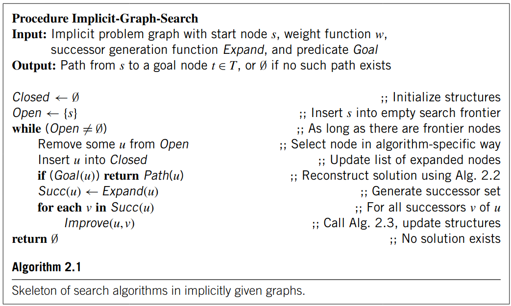
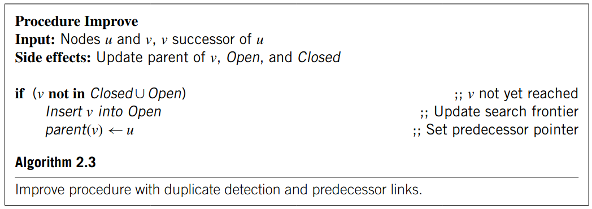

# Algoritmos de búsqueda

Partes fundamentales de un algoritmo de búsqueda:
- `Open` list: Lista de estados abiertos (generados pero no expandidos). Cola de prioridad
- `Close` list: Lista de estados cerrados (ya expandidos). Tabla hash.
- `s` y `u`: Estados. Representan un estado del problema en un momento determinado.
- `Goal()`: Función que recibe un estado y determina si corresponde a un estado objetivo.
- `Succ()`: Función que recibe un estado `s` y genera los estados sucesores. Los estados sucesores son todos aquellos estados $v \in V$ que derivan de aplicar todas las acciones disponibles. 
- `Ìmprove(u,v)`: Agrega cada estado sucesor a la lista de `Open`, sí corresponde. 

Bibliografia:
Edelkamp, S., & Schrodl, S. (2011). Heuristic search: theory and applications. Elsevier.